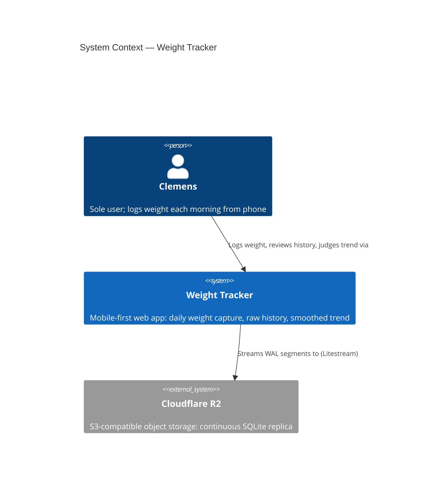
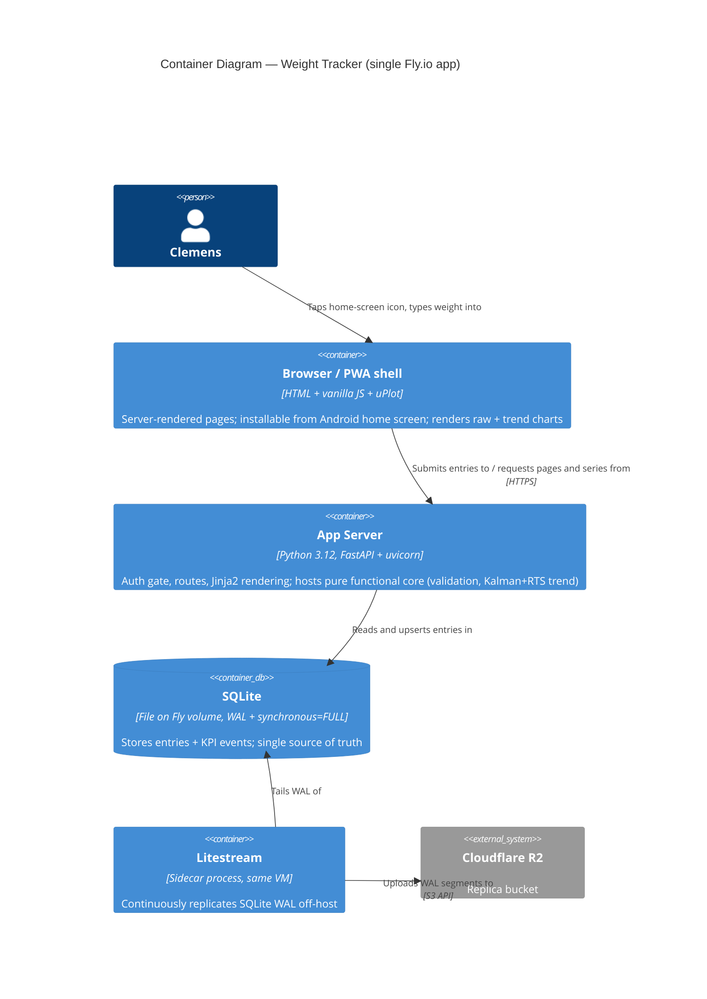

<!-- markdownlint-disable MD024 -->
# Architecture Brief — weight-tracker

Section ownership: `## Application Architecture` = solution-architect (Morgan). First architect on this SSOT (bootstrapped 2026-07-22, DESIGN wave of feature `weight-trend-tracker`). No prior `## System Architecture` / `## Domain Model` sections exist.

## System Context

Single-user, mobile-first web app: Clemens logs one weight per calendar day in seconds and judges progress via a smoothed, gap-robust trend. Sole customer = sole developer. Locked product constraints: metric kg, 30.0–250.0 range at 0.1 precision, one entry per device-local day (re-save replaces), no future dates, no export/import/calorie features, passphrase access protection, confirmed saves never lost, ~5 dev days, near-zero hosting cost.

## Application Architecture

### Style

Modular monolith, ports-and-adapters, **Functional Core / Imperative Shell** (ADR-005). Single deployable. Rejected simpler/other shapes: static SPA + client storage (fails durability guardrail — phone loss = data loss), multi-service split (absurd at this scale, team of 1).

### C4 Level 1 — System Context

### C4 Level 2 — Container

L3 omitted: fewer than 5 internal components per container (threshold not met).

### Component Decomposition and Ports

| Component | Kind | Contract shape | Responsibility / interface | Probe (Earned Trust) |
|---|---|---|---|---|
| Domain Core | pure module | pure-function (return-only) | Validation (range/precision/no-future/one-per-day resolution), window filtering, `trend_series(entries) -> [TrendPoint]` = Kalman forward + RTS backward pass on daily grid (ADR-004); `glance(entries) -> GlanceSummary \| None` = series-end trend value + trailing-7-day endpoint-difference weekly rate with 0.05-step quantization/glyph rule (ADR-006) | n/a (pure; property-based tests in CI) |
| `WeightLogging` | driving port | bounded-change (mutation universe = single `{date}` row + one telemetry event) | `record_or_replace(date, kg, entry_ms) -> Saved \| Rejected` | exercised via AT suite |
| `WeightHistory` | driving port | read-only — **no write methods** | `entries_in(range) -> [Entry]`, `yesterday() -> Entry?` | exercised via AT suite |
| `TrendProjection` | driving port | read-only, derived-never-stored — **no write methods** | `trend_series_in(range) -> [TrendPoint]` on daily calendar grid (gap days included; smoothed values revise as entries arrive — pure function of full entry set); extended read surface (`home-trend-display`, 2026-07-23): glance summary as a **second injected pure callable** at the composition root (ADR-006) — still read-only | exercised via AT suite (determinism @property) |
| `AccessGate` | driving middleware | read-only per request | Passphrase POST → argon2 verify → signed HttpOnly cookie (90 d); guards all routes; login rate-limited (ADR-003) | startup: `PASSPHRASE_HASH` + `SESSION_SIGNING_KEY` present and parseable, else `health.startup.refused` |
| `EntryStore` | driven adapter (SQLite) | bounded-change (tables `entries` PK `date`, `events` append-only) | Durable upsert/read of `{date, weight_kg, logged_at, entry_ms}`; KPI events | `probe()`: open; `PRAGMA integrity_check`; assert WAL + `synchronous=FULL`; sentinel write→fsync→readback; statfs ≠ tmpfs (overlayfs/tmpfs fsync-lie check). Failure ⇒ refuse start |
| `Clock` | driven adapter | pure read | Server "now" for future-date sanity bound (client local date allowed ≤ server UTC date + 1) | `probe()`: year ∈ [2026, 2100] |
| Web UI | driving adapter | — | Jinja2 templates, uPlot charts (Trend↔Raw toggle, shared `selected_time_scale`), PWA manifest + minimal service worker (Android install, app-shell cache only, no offline queueing); calm-minimal theme via `static/theme.css` — design tokens, follow-system light/dark (ADR-007) | AT `@property` checks (≤2 s interactive); stylesheet-loss fault injection (app usable unstyled) |
| Composition root | shell | — | Wire → **probe all driven adapters** → serve; any probe failure = structured `health.startup.refused`, no traffic served | startup self-test asserts every driven adapter implements `probe()` |

Dependency rule: Domain Core imports nothing from shell/adapters. Enforcement (3 layers): `import-linter` layer contract (core → nothing outward); AST pre-commit hook asserting `probe()` presence on driven adapters (import-linter cannot enforce method presence); mypy strict + `Protocol` conformance at the composition root.

Glance delivery (`home-trend-display`, DESIGN 2026-07-23, ADR-006): `GET /` renders the glance line server-side from the entry list it already fetches (zero added I/O/HTTP against the ≤2 s entry-primacy guardrail); `POST /entries` includes a `glance` field (or null) in its JSON response for the in-place refresh, including first appearance after the very first entry. This response enrichment and the route-level `trend.glance.shown` emission (per delivery, via the established `append_event` pattern) are **driving-adapter (route) concerns — NOT a widening of `WeightLogging.record_or_replace`**, whose bounded-change universe stays one `{date}` row + one `entry.saved` event (precedent: the derived `confirmation` field already in the save response). KPI-3 separation is structural: the glance never touches `GET /trend`. Glance failure degrades to an absent line (glance = null); logging and saving are never blocked.

Theming delta (`calm-visual-theme`, DESIGN 2026-07-23, ADR-007): one new static asset `web/static/theme.css` (hand-written design-token stylesheet, CUBE-lite layers, ~4.7 KB, ≤ 10 KB budget) served by the existing static route — **zero port, adapter, container, or C4 changes**. Both color schemes first-class via `prefers-color-scheme`; WCAG AA pairs pinned in the feature-delta token table (DISTILL contract for G-4). Entry screen keeps its zero-new-JS pin; the graph page gains ~8 lines of `matchMedia` wiring that re-renders through the existing `showGraph` path (lens + scale preserved), with uPlot colors read from the tokens (hard-coded hexes removed). `PWA_MANIFEST` colors align to the palette; `theme.css` joins the `sw.js` APP_SHELL. Vendored uPlot files stay byte-identical. Degradation: no stylesheet → unstyled but fully functional.

Graph-first home delta (`graph-first-home`, DESIGN 2026-07-24, ADR-008 + ADR-009): the front page becomes the ambient picture (full-control trend graph above the form, glance line kept, last-7 entries list below); `/graph` becomes the combined History page (graph + complete entries list, deep links `?view=`/`?scale=` preserved by construction — A16). Chart JS is **extracted from `graph.html` into shared `web/static/graph.js`** (only new asset; joins the `sw.js` APP_SHELL) and both pages load it deferred; the front-page graph **fetches `/trend`/`/entries` asynchronously** exactly as the History page does, post-save refresh = refetch at the current lens/scale, failure or 0 entries → absent graph area, never a blocked entry (ADR-008). Telemetry moves to intent surfaces (ADR-009): `GET /` appends `home.graph.shown` when entries exist (ambient, KPI-7; D-14 per-delivery pattern), `GET /graph` appends `trend.study.opened` (deliberate), explicit lens/scale taps fire the fire-and-forget beacon `POST /telemetry/trend-study` → `trend.study.interaction` (closed vocabulary, unknown → 400); the **`trend.view.opened` emission on `GET /trend` is retired** — series/history reads are pure reads, so a log-only morning adds 0 to KPI-3 by construction. **Zero port changes**: last-7 list = pure slice of the `all_entries()` read `GET /` already performs (newest-first), complete list = the same read server-rendered in the `/graph` template; the `recent` field on the `POST /entries` response is route-level enrichment (precedent: `glance`/`confirmation` — `WeightLogging`'s universe stays one `{date}` row + one `entry.saved` event); read-only ports gain no methods at all. No new driven adapters ⇒ no new probes; no C4 L1/L2 changes. Per-surface lens/scale per A17 (front page ignores query params, defaults Trend/3M). Calm-theme rules extend to the new elements; G-5's "0 new entry-screen scripts" AT clause is consciously renegotiated at DISTILL (two same-origin vendored scripts join `/`; zero new external origins holds).

Dated-entry delta (`entry-date-picker`, DESIGN 2026-07-24, ADR-010 + ADR-011): the entry screen gains a native `<input type="date">` above the weight field, defaulted to the device-local day, so `js-3-maintain` (backfill a missed day, correct a typo) is served in place — **zero new ports, adapters, containers, routes, assets, dependencies, external origins, or C4 changes**. Prefill (ADR-010): the shipped 4-entry `recent_weights_map` widens to a **whole-record `{iso_day: kg}` map rendered inline** in the existing template slot — a pure projection of the `all_entries()` read `GET /` already performs (zero added I/O, precedent: the last-7 slice, D-18), so **one** client map answers both the yesterday anchor and the prefill for any stored day, synchronously, with no async race and no new failure mode; missing key ⇒ no-entry presentation, missing map ⇒ script guard, the save is never blocked (degrade-to-absent). KPI-1 sample purity (ADR-011): the save message gains **one additive, optional, backward-compatible `today` field** — the same device-day claim `?today=` already carries on reads (A5) — and the route classifies `backdated = entry_day != skew-clamped claim` **after** validation via a pure core function (`bounded_day_frame` / `is_backdated`, extracted so one copy of the calendar arithmetic survives); a backdated save records `entry_ms` as **null**, so it contributes 0 entry-speed samples through the shipped null-skip, and carries `"backdated": true` on the `entry.saved` payload for the KPI-8 repair counter (new read-model query `backdated_saves_since`, `entry_ms_samples_since` pattern, wired by `partial` at the composition root). `WeightLogging`'s bounded-change universe stays **one `{date}` row + one `entry.saved` event** — the payload flag and the response are route-level concerns, never a port widening (`glance`/`recent`/`confirmation` precedent); `WeightHistory`/`TrendProjection` gain **no methods at all**. One hint node (`#entry-hint`, renamed from `#yesterday-reference`) carries three mutually exclusive states — yesterday anchor when the date is today, `Editing {day} — was {v} kg`, `No entry for {day} yet` — so "never two hints" is structural; the line reserves its height permanently because it now changes mid-session (technique: the chart's `min-height`, entry primacy under the thumb). `max` and `value` are client-set (the server has no device day), `min` = first entry day − 1 year is a server-supplied UX assist against a mistyped year, and the **server's skew-bounded no-future rule stays authoritative**. No schema migration (`entry_ms` already nullable) and no new driven adapter ⇒ **no new Earned-Trust probes**; the one newly trusted input, the phone's claimed day, is skew-clamped and backstopped by `validate_entry_date`. Post-save the date resets to device today and the field clears (D8); the existing save-response refresh (glance + recent + `entry-saved` graph refetch) covers backdated entries by construction. Three inherited-AT touchpoints are consciously renegotiated at DISTILL (map-const rename, OUT-1 input shape, the entry-readiness scenario extended with no-focus-theft) — all loud-failure, never silent.

### Technology Stack (all OSS; pin exact patch versions in lock files at DELIVER)

| Choice | Version (min) | License | Role |
|---|---|---|---|
| Python | 3.12 | PSF | Language (backend + pure core) |
| FastAPI / uvicorn | 0.116 / 0.35 | MIT / BSD-3 | HTTP shell |
| Jinja2 | 3.1 | BSD-3 | Server-rendered UI |
| uPlot | 1.6 | MIT | Charts (~45 kB, mobile-fast) |
| SQLite (stdlib `sqlite3`) | 3.45+ | Public domain | Persistence |
| Litestream | 0.3.13 | Apache-2.0 | Continuous replication → R2 |
| argon2-cffi / itsdangerous | 25.1 / 2.2 | MIT / BSD-3 | Passphrase hash / signed cookie |
| pytest / hypothesis | 8 / 6 | MIT / MPL-2.0 | Tests / property-based tests |
| import-linter | 2.x | BSD-2 | Layer enforcement |
| Fly.io shared-cpu-1x + 1 GB volume; Cloudflare R2 free tier | — | — | Hosting ~$2–3/mo (ADR-001) |

### Quality Attribute Strategies (ISO 25010)

- **Reliability/durability** (guardrail: zero lost entries): confirm-after-commit (`synchronous=FULL`), Litestream off-host replica, startup probes refuse to serve on lying substrate, restore drill owned by DEVOPS (ADR-002).
- **Performance**: server-rendered pages + 45 kB chart lib → ≤2 s interactive on mobile (US-002/US-006); trend recompute O(n) scalar fold, microseconds at ≤ decades of data.
- **Security**: single shared passphrase, argon2id hash in env secret, signed HttpOnly SameSite=Lax cookie, login rate limit, HTTPS via Fly edge (ADR-003). Threat model proportionate: protects a public URL holding one person's weight data.
- **Maintainability/testability**: pure core (trend + validation) fully unit/property-testable without I/O; ports mockable; one language.
- **Usability**: PWA install, auto-focused `inputmode="decimal"` field, yesterday reference, WCAG 2.2 AA basics.
- **Observability** (proportionate to solo-operated single-user app): (a) structured JSON logs to stdout (Fly log drain), event names `health.startup.refused`, `entry.saved`, `auth.login.{ok,rejected,rate_limited}`; (b) **Litestream replication liveness**: `/healthz` endpoint reports last successful replication timestamp (via Litestream metrics endpoint); external free uptime monitor (e.g., UptimeRobot) polls every 5 min and alerts by email if unhealthy or replication lag > 15 min; (c) startup probe failures surface as `health.startup.refused` log + failed health check (Fly restarts + alert fires); (d) KPI queries over the `events` table (weekly logging adherence KPI-2, entry timing KPI-1, trend-view opens KPI-3) — a simple stats page or SQL snippets, dashboard design owned by platform-architect. DEVOPS handoff contract: monitoring cadence, alert channel, and scheduled restore drill (§ External Integrations) to be finalized by platform-architect before DELIVER completes.

### Deployment

Dockerfile: `litestream replicate -exec "uvicorn app:asgi"` (supervisor pattern); volume at `/data`; Fly secrets: `PASSPHRASE_HASH`, `SESSION_SIGNING_KEY`, R2 credentials. Deploy: `fly deploy` from CLI or GitHub Actions; walking skeleton (slice 01) ships to production day 1.

### External Integrations (annotation for platform-architect)

- **Cloudflare R2 (S3 API, via Litestream)** — infrastructure-level integration; the contract-test analog here is a **scheduled restore drill** (`litestream restore` to scratch + integrity check + row-count comparison), not Pact. Include in CI/ops design. Litestream replication liveness must be monitored (see DEVOPS handoff). No application-level third-party APIs exist; no consumer-driven contract tests required.

### ADR Index

| ADR | Decision |
|---|---|
| [ADR-001](adr-001-stack-and-hosting.md) | Python/FastAPI monolith on Fly.io (Option A) |
| [ADR-002](adr-002-persistence-durability.md) | SQLite + Litestream → R2 durability strategy |
| [ADR-003](adr-003-passphrase-auth.md) | Passphrase auth via argon2 + signed cookie |
| [ADR-004](adr-004-trend-algorithm.md) | Trend = local-level Kalman filter + RTS smoother (Huberized) |
| [ADR-005](adr-005-functional-core-paradigm.md) | Functional Core / Imperative Shell paradigm |
| [ADR-006](adr-006-glance-rate-derivation.md) | Glance weekly rate = trailing-7-day endpoint difference of the smoothed series (does not supersede ADR-004) |
| [ADR-007](adr-007-theming-mechanism.md) | Theming = hand-written design-token stylesheet (CUBE-lite), follow-system schemes; frameworks rejected on byte budget |
| [ADR-008](adr-008-front-page-graph-delivery.md) | Front-page graph = async fetch via shared extracted `graph.js` (one chart code path for both surfaces) |
| [ADR-009](adr-009-intent-telemetry.md) | Intent telemetry route-level: `home.graph.shown` / `trend.study.opened` / `trend.study.interaction` (beacon); `trend.view.opened` emission retired — data reads pure |
| [ADR-010](adr-010-prefill-delivery.md) | Edit prefill = whole-record `{iso_day: kg}` map rendered inline on `GET /` (one map, zero added I/O, browser-less testability) |
| [ADR-011](adr-011-backdated-save-classification.md) | Backdated saves classified at write time from the phone's claimed day; `entry_ms` withheld (0 KPI-1 samples) + `backdated` payload marker for KPI-8 |

### Component Inventory (shipped — DELIVER 2026-07-23)

All components from the decomposition table above shipped; none deferred. DELIVER-era additions within the sanctioned layout: `main.py` (production entrypoint, env-driven wiring), `shell/telemetry_store.py` (read-model queries over the shared `events` table), schema-version rollback guard in `shell/entry_store.py` + composition (DEVOPS pre-req 2a), `core/types.py:parse_time_scale` (total scale parser; hostile query input → 400), `scripts/check_probe_presence.py` (AST probe-presence gate). Trend uncertainty band (DESIGN OpenQ-5) not rendered — deferred, optional.

Glance derivation (shipped 2026-07-23, DELIVER of `home-trend-display`): pure `core/glance.py` (glance/quantize_rate/rate_glyph per ADR-006) + shell delivery — glance in `GET /` render and `POST /entries` response, `trend.glance.shown` per delivery, `trend_glance_shown_count` on /stats (rolling 7-day window).

Calm visual theme (shipped 2026-07-23, DELIVER of `calm-visual-theme`, ADR-007): `web/static/theme.css` — hand-written design-token stylesheet (CUBE-lite layers; 3,394 bytes vs 10 KB budget), light + dark via `prefers-color-scheme`, linked from all three templates (index/graph/door; inline `<style>` blocks migrated and deleted). Chart colors read from `--chart-*` tokens via `getComputedStyle` + one `matchMedia` re-render listener (graph page only). `sw.js` APP_SHELL includes the theme, `SHELL_CACHE` bumped to `-v2`; `PWA_MANIFEST` colors aligned to the palette. Zero new ports, adapters, or containers — the stylesheet lives inside the existing Browser/PWA-shell container, served by the existing static route.

Graph-first home (shipped 2026-07-24, DELIVER of `graph-first-home`, ADR-008 + ADR-009): `graph.html`'s inline chart JS extracted into shared `web/static/graph.js` — one chart code path (fetch, grid builders, themed uPlot render, lens/scale state, matchMedia re-render) now drives BOTH surfaces; joined the sw.js APP_SHELL with `SHELL_CACHE` bumped to `-v3`. Front page (`GET /` + `index.html`): graph mount with full lens/scale controls above the untouched entry form, last-7 recent list below it (server-rendered, display-only, pure slice of the already-fetched entries), `recent` field in the `POST /entries` response driving the in-place refresh. History page (`GET /graph` + `graph.html`): complete entries list server-rendered from `all_entries()` beneath the full-control chart, independent of the chart window; deep links, back-link, and empty-invite preserved. New beacon route `POST /telemetry/trend-study` (closed vocabulary → one `trend.study.interaction` append; unknown → 400, fire-and-forget, behind AccessGate). Intent-telemetry flip (ADR-009): `trend.view.opened` emission retired (`GET /trend` now a pure read, historical rows preserved) → `home.graph.shown` (ambient, KPI-7) / `trend.study.opened` / `trend.study.interaction` (deliberate, KPI-3 redefined); `/stats` gained `trend_study_this_week` + `home_graph_shown_this_week` beside the frozen-historical `trend_view_opened_count`. All new logic = pure helpers in `routes.py` (study-signal parsing, recent-head slicing, row/wire formatting); zero port changes, zero new adapters or containers, zero new dependencies. Nothing planned was deferred.

Dated entry (shipped 2026-07-25, DELIVER of `entry-date-picker`, ADR-010 + ADR-011): the entry screen (`index.html`) gained a native `<input type="date" id="entry-date">` above the weight field — no `autofocus`, `value`/`max` client-set from `deviceLocalDay()`, `min` = first entry day − 1 year supplied by `GET /` — so `js-3-maintain` (backfill a missed day, correct a typo) is served in place. Prefill (ADR-010): `recent_weights_map` widened to `record_weights_map`, the **whole record as an inline `{iso_day: kg}` map** in the same template slot — a pure projection of the `all_entries()` read `GET /` already performs, so one client map answers both the yesterday anchor and the prefill for any stored day (`RECENT_ANCHOR_ENTRIES` retired with its sole consumer); missing key ⇒ no-entry presentation, missing map ⇒ script guard, the save is never blocked. One hint node (`#entry-hint`, renamed from `#yesterday-reference`, never removed, height reserved) carries three mutually exclusive states from the pure client `hintFor`, with day labels through the extracted `dayLabel(iso)` — one `Fri 24 Jul` grammar across client, server rows, and confirmations. KPI-1 sample purity + KPI-8 (ADR-011): new pure core `bounded_day_frame` / `is_backdated` in `core/validation.py` (the clamp arithmetic extracted from `day_frame_or_bad_request`, so one copy of the calendar rule survives); `POST /entries` reads an additive optional `today` claim and classifies **after** validation — a backdated save records `entry_ms` NULL (0 entry-speed samples via the shipped null-skip) and stamps `"backdated": true` on the `entry.saved` payload; absent or garbled claim falls back to server UTC and never blocks or 400s a save. New read-model query `shell/telemetry_store.py:backdated_saves_since` (payload predicate, `entry_ms_samples_since` pattern) wired by `partial` at the composition root, served as `backdated_saves_this_week` on `/stats`. `theme.css` gained `#entry-date` / `#entry-hint` rules (reserved line height, ≥44 px, AA both schemes); `sw.js` kept its APP_SHELL list unchanged but bumped `SHELL_CACHE` to `-v4`, because `/` is itself pre-cached and its response changed (the bump trigger is a changed pre-cached response, not a new asset). Zero port changes (read-only ports gain no methods at all), zero new adapters, routes, assets, dependencies, external origins, or Earned-Trust probes; no schema migration (`entry_ms` already nullable, `CODE_SCHEMA_VERSION` stays 1). Nothing planned was deferred.
