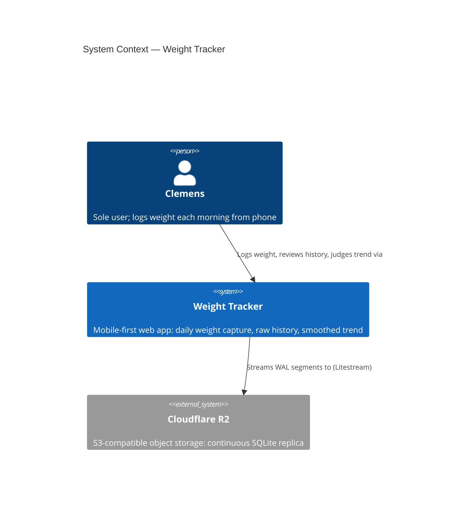
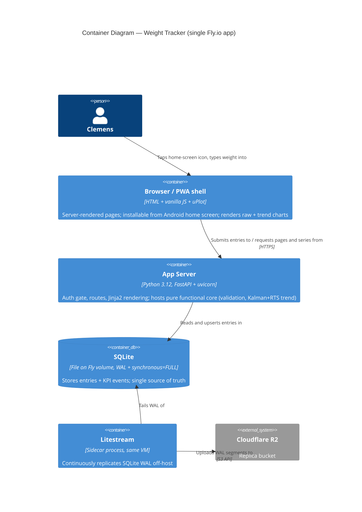

<!-- markdownlint-disable MD024 -->
# Architecture Brief — weight-tracker

Section ownership: `## Application Architecture` = solution-architect (Morgan). First architect on this SSOT (bootstrapped 2026-07-22, DESIGN wave of feature `weight-trend-tracker`). No prior `## System Architecture` / `## Domain Model` sections exist.

## System Context

Single-user, mobile-first web app: Clemens logs one weight per calendar day in seconds and judges progress via a smoothed, gap-robust trend. Sole customer = sole developer. Locked product constraints: metric kg, 30.0–250.0 range at 0.1 precision, one entry per device-local day (re-save replaces), no future dates, no export/import/calorie features, passphrase access protection, confirmed saves never lost, ~5 dev days, near-zero hosting cost.

## Application Architecture

### Style

Modular monolith, ports-and-adapters, **Functional Core / Imperative Shell** (ADR-005). Single deployable. Rejected simpler/other shapes: static SPA + client storage (fails durability guardrail — phone loss = data loss), multi-service split (absurd at this scale, team of 1).

### C4 Level 1 — System Context

### C4 Level 2 — Container

L3 omitted: fewer than 5 internal components per container (threshold not met).

### Component Decomposition and Ports

| Component | Kind | Contract shape | Responsibility / interface | Probe (Earned Trust) |
|---|---|---|---|---|
| Domain Core | pure module | pure-function (return-only) | Validation (range/precision/no-future/one-per-day resolution), window filtering, `trend_series(entries) -> [TrendPoint]` = Kalman forward + RTS backward pass on daily grid (ADR-004); `glance(entries) -> GlanceSummary \| None` = series-end trend value + trailing-7-day endpoint-difference weekly rate with 0.05-step quantization/glyph rule (ADR-006) | n/a (pure; property-based tests in CI) |
| `WeightLogging` | driving port | bounded-change (mutation universe = single `{date}` row + one telemetry event) | `record_or_replace(date, kg, entry_ms) -> Saved \| Rejected` | exercised via AT suite |
| `WeightHistory` | driving port | read-only — **no write methods** | `entries_in(range) -> [Entry]`, `yesterday() -> Entry?` | exercised via AT suite |
| `TrendProjection` | driving port | read-only, derived-never-stored — **no write methods** | `trend_series_in(range) -> [TrendPoint]` on daily calendar grid (gap days included; smoothed values revise as entries arrive — pure function of full entry set); extended read surface (`home-trend-display`, 2026-07-23): glance summary as a **second injected pure callable** at the composition root (ADR-006) — still read-only | exercised via AT suite (determinism @property) |
| `AccessGate` | driving middleware | read-only per request | Passphrase POST → argon2 verify → signed HttpOnly cookie (90 d); guards all routes; login rate-limited (ADR-003) | startup: `PASSPHRASE_HASH` + `SESSION_SIGNING_KEY` present and parseable, else `health.startup.refused` |
| `EntryStore` | driven adapter (SQLite) | bounded-change (tables `entries` PK `date`, `events` append-only) | Durable upsert/read of `{date, weight_kg, logged_at, entry_ms}`; KPI events | `probe()`: open; `PRAGMA integrity_check`; assert WAL + `synchronous=FULL`; sentinel write→fsync→readback; statfs ≠ tmpfs (overlayfs/tmpfs fsync-lie check). Failure ⇒ refuse start |
| `Clock` | driven adapter | pure read | Server "now" for future-date sanity bound (client local date allowed ≤ server UTC date + 1) | `probe()`: year ∈ [2026, 2100] |
| Web UI | driving adapter | — | Jinja2 templates, uPlot charts (Trend↔Raw toggle, shared `selected_time_scale`), PWA manifest + minimal service worker (Android install, app-shell cache only, no offline queueing) | AT `@property` checks (≤2 s interactive) |
| Composition root | shell | — | Wire → **probe all driven adapters** → serve; any probe failure = structured `health.startup.refused`, no traffic served | startup self-test asserts every driven adapter implements `probe()` |

Dependency rule: Domain Core imports nothing from shell/adapters. Enforcement (3 layers): `import-linter` layer contract (core → nothing outward); AST pre-commit hook asserting `probe()` presence on driven adapters (import-linter cannot enforce method presence); mypy strict + `Protocol` conformance at the composition root.

Glance delivery (`home-trend-display`, DESIGN 2026-07-23, ADR-006): `GET /` renders the glance line server-side from the entry list it already fetches (zero added I/O/HTTP against the ≤2 s entry-primacy guardrail); `POST /entries` includes a `glance` field (or null) in its JSON response for the in-place refresh, including first appearance after the very first entry. This response enrichment and the route-level `trend.glance.shown` emission (per delivery, via the established `append_event` pattern) are **driving-adapter (route) concerns — NOT a widening of `WeightLogging.record_or_replace`**, whose bounded-change universe stays one `{date}` row + one `entry.saved` event (precedent: the derived `confirmation` field already in the save response). KPI-3 separation is structural: the glance never touches `GET /trend`. Glance failure degrades to an absent line (glance = null); logging and saving are never blocked.

### Technology Stack (all OSS; pin exact patch versions in lock files at DELIVER)

| Choice | Version (min) | License | Role |
|---|---|---|---|
| Python | 3.12 | PSF | Language (backend + pure core) |
| FastAPI / uvicorn | 0.116 / 0.35 | MIT / BSD-3 | HTTP shell |
| Jinja2 | 3.1 | BSD-3 | Server-rendered UI |
| uPlot | 1.6 | MIT | Charts (~45 kB, mobile-fast) |
| SQLite (stdlib `sqlite3`) | 3.45+ | Public domain | Persistence |
| Litestream | 0.3.13 | Apache-2.0 | Continuous replication → R2 |
| argon2-cffi / itsdangerous | 25.1 / 2.2 | MIT / BSD-3 | Passphrase hash / signed cookie |
| pytest / hypothesis | 8 / 6 | MIT / MPL-2.0 | Tests / property-based tests |
| import-linter | 2.x | BSD-2 | Layer enforcement |
| Fly.io shared-cpu-1x + 1 GB volume; Cloudflare R2 free tier | — | — | Hosting ~$2–3/mo (ADR-001) |

### Quality Attribute Strategies (ISO 25010)

- **Reliability/durability** (guardrail: zero lost entries): confirm-after-commit (`synchronous=FULL`), Litestream off-host replica, startup probes refuse to serve on lying substrate, restore drill owned by DEVOPS (ADR-002).
- **Performance**: server-rendered pages + 45 kB chart lib → ≤2 s interactive on mobile (US-002/US-006); trend recompute O(n) scalar fold, microseconds at ≤ decades of data.
- **Security**: single shared passphrase, argon2id hash in env secret, signed HttpOnly SameSite=Lax cookie, login rate limit, HTTPS via Fly edge (ADR-003). Threat model proportionate: protects a public URL holding one person's weight data.
- **Maintainability/testability**: pure core (trend + validation) fully unit/property-testable without I/O; ports mockable; one language.
- **Usability**: PWA install, auto-focused `inputmode="decimal"` field, yesterday reference, WCAG 2.2 AA basics.
- **Observability** (proportionate to solo-operated single-user app): (a) structured JSON logs to stdout (Fly log drain), event names `health.startup.refused`, `entry.saved`, `auth.login.{ok,rejected,rate_limited}`; (b) **Litestream replication liveness**: `/healthz` endpoint reports last successful replication timestamp (via Litestream metrics endpoint); external free uptime monitor (e.g., UptimeRobot) polls every 5 min and alerts by email if unhealthy or replication lag > 15 min; (c) startup probe failures surface as `health.startup.refused` log + failed health check (Fly restarts + alert fires); (d) KPI queries over the `events` table (weekly logging adherence KPI-2, entry timing KPI-1, trend-view opens KPI-3) — a simple stats page or SQL snippets, dashboard design owned by platform-architect. DEVOPS handoff contract: monitoring cadence, alert channel, and scheduled restore drill (§ External Integrations) to be finalized by platform-architect before DELIVER completes.

### Deployment

Dockerfile: `litestream replicate -exec "uvicorn app:asgi"` (supervisor pattern); volume at `/data`; Fly secrets: `PASSPHRASE_HASH`, `SESSION_SIGNING_KEY`, R2 credentials. Deploy: `fly deploy` from CLI or GitHub Actions; walking skeleton (slice 01) ships to production day 1.

### External Integrations (annotation for platform-architect)

- **Cloudflare R2 (S3 API, via Litestream)** — infrastructure-level integration; the contract-test analog here is a **scheduled restore drill** (`litestream restore` to scratch + integrity check + row-count comparison), not Pact. Include in CI/ops design. Litestream replication liveness must be monitored (see DEVOPS handoff). No application-level third-party APIs exist; no consumer-driven contract tests required.

### ADR Index

| ADR | Decision |
|---|---|
| [ADR-001](adr-001-stack-and-hosting.md) | Python/FastAPI monolith on Fly.io (Option A) |
| [ADR-002](adr-002-persistence-durability.md) | SQLite + Litestream → R2 durability strategy |
| [ADR-003](adr-003-passphrase-auth.md) | Passphrase auth via argon2 + signed cookie |
| [ADR-004](adr-004-trend-algorithm.md) | Trend = local-level Kalman filter + RTS smoother (Huberized) |
| [ADR-005](adr-005-functional-core-paradigm.md) | Functional Core / Imperative Shell paradigm |
| [ADR-006](adr-006-glance-rate-derivation.md) | Glance weekly rate = trailing-7-day endpoint difference of the smoothed series (does not supersede ADR-004) |

### Component Inventory (shipped — DELIVER 2026-07-23)

All components from the decomposition table above shipped; none deferred. DELIVER-era additions within the sanctioned layout: `main.py` (production entrypoint, env-driven wiring), `shell/telemetry_store.py` (read-model queries over the shared `events` table), schema-version rollback guard in `shell/entry_store.py` + composition (DEVOPS pre-req 2a), `core/types.py:parse_time_scale` (total scale parser; hostile query input → 400), `scripts/check_probe_presence.py` (AST probe-presence gate). Trend uncertainty band (DESIGN OpenQ-5) not rendered — deferred, optional.

Glance derivation (shipped 2026-07-23, DELIVER of `home-trend-display`): pure `core/glance.py` (glance/quantize_rate/rate_glyph per ADR-006) + shell delivery — glance in `GET /` render and `POST /entries` response, `trend.glance.shown` per delivery, `trend_glance_shown_count` on /stats (rolling 7-day window).
